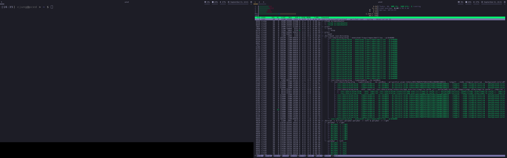

# Cédric Jung's dotfiles



* https://www.youtube.com/watch?v=oHbJK6r2Xwo

List of packages
```
compton
feh
polybar
rofi
rxvt-unicode
font-awesome
i3-gaps
```
To open config panel:
```
$ env XDG_CURRENTKTOP=GNOME gnome-control-center
```

List of python packages:
```
i3ipc
```

For autotiling see: [nwg-piotr/autotiling](https://github.com/nwg-piotr/autotiling)
